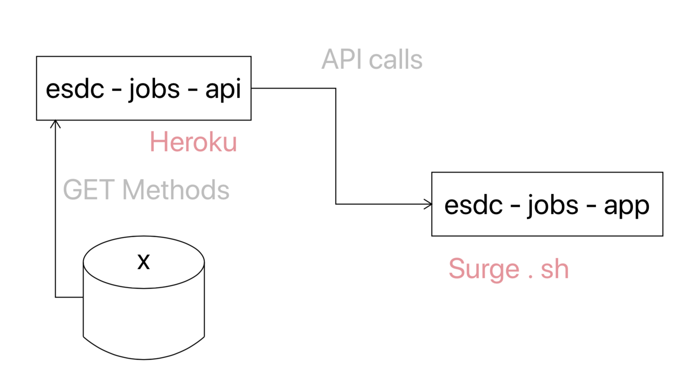

# career handbook

The goal of this project is to host a user interface that allows the user to search the The National Occupational Classification (NOC) database. The database contains over 30,000 occupational titles, grouped into 500 Unit Groups, and organized according to skill level and type. The 2016 Career Handbook further defines these occupational titles by assigning work characteristics and descriptor scale ratings to the NOC occupational titles.

## Motivation

The Government of Canada provides a user interface to search this database but it does not allow the user to constrain their searchs by more than one work characteristic. In other words, it does not allow AND searches between work characteristics. 

## How it works

The user interface has two ways of search for occupations:
- **Form** prompts the user to fill out a form with descriptor scale ratings for some or all of the work characteristics specified by the NOC. When the form is completed, a list of occupations compatible with the descriptor scale ratings will appear below the form. The user can then select an occupation from the list and a full report of that occupation will appear to the right of the list.

- **Search** allows the user to search for an occupation. A list of occupations matching the search term will appear below the search field. The user can select an occupation from this list and a full report of that occupation will appear. 

## Architecture

The architecture of the system consists of three main entities:

1. **esdc-jobs-api** is the back-end of the system
2. **esdc-jobs-app** is the front-end of the system
3. **PostgreSQL database** stores the NOC database (database provided by the National Occupational Classification)

